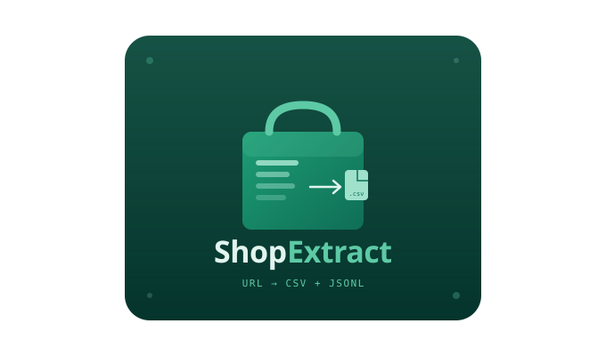
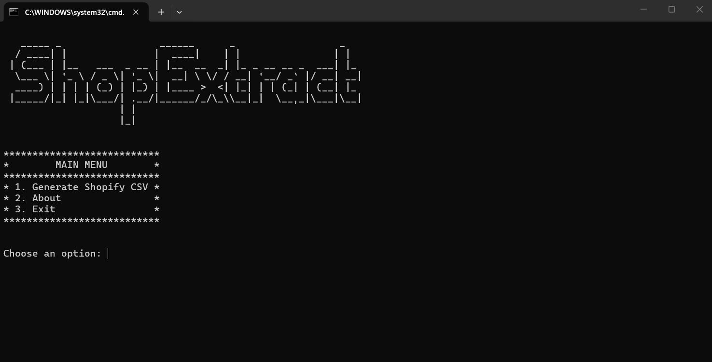
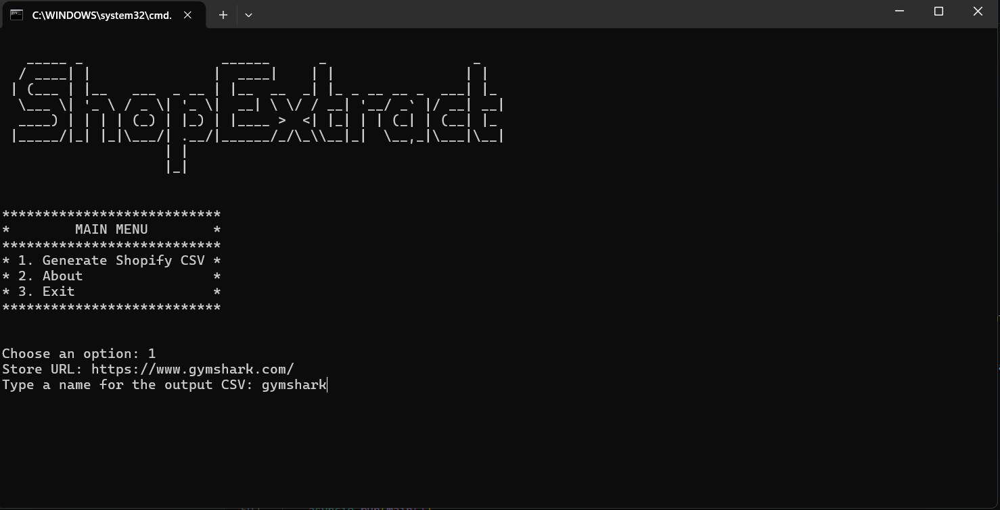
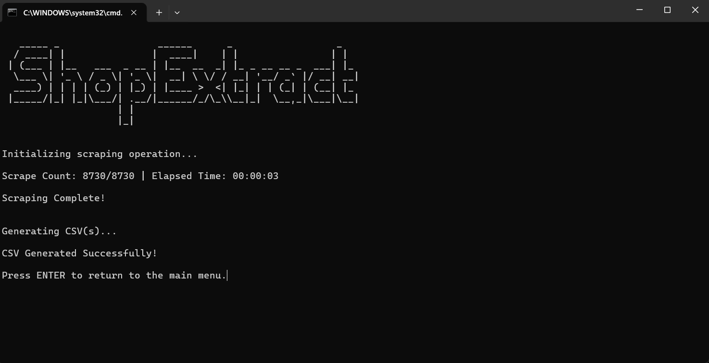
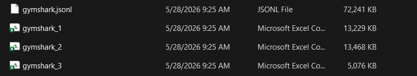
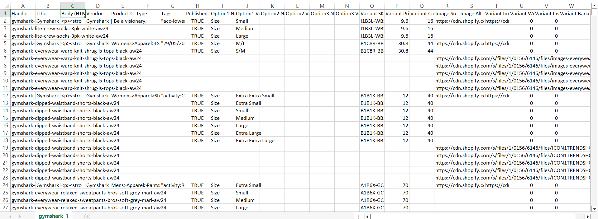

# ShopExtract &mdash; The Only Tool You Need to Extract Full Shopify Product Catalogs



## Changelog

**May 30, 2026**

1. Migrated from curl_cffi to wreq.
2. Upgraded the collections aggregation strategy to have concurrency at the collections level, resulting in a tremendously faster collections aggregation strategy for stores with more than 25k products.


## Features

1. Interactive menu-based text-user-interface (TUI) with live on-screen scraping progress.
2. Very fast scraping (~ up to 3,000 products/sec).
3. Bypasses Cloudflare's anti-bot protections.
4. Handles timeouts via auto-retries and exponential back-off.
5. Bypasses /products.json endpoint blocks by auto-detecting a store's myshopify.com domain.
6. Produces ready-to-import CSVs (with proper column and row-formatting) to allow the user to immediately use the CSVs in Shopify.
7. Respects the 15-MB-size and 50,000-row Shopify limits per CSV. For large catalogs, it auto-splits the data into multiple CSVs.

## Outputs

For any Shopify store, the scraper produces a JSON Lines (.jsonl) file that contains the entire product catalog and one or more CSV files with proper formatting for immediate Shopify product import.


## Limits

For stores with product catalogs of more than 25,000 products, the scraper falls back to the collections aggregation strategy, which makes it slower (mitigated significantly in the May 30, 2026 update).

## Setup

Make sure you navigate to the project folder, then write the commands below.

### Create new virtual environment

**MacOS/Linux**
```bash
python3 -m venv venv
```

**Windows**
```cmd
python -m venv venv
```

### Activate virtual environment

**MacOS/Linux**
```bash
source venv/bin/activate
```

**Windows CMD**
```cmd
.\venv\Scripts\activate
```

**Windows Bash**
```bash
source venv/Scripts/activate
```

### Install dependencies

**MacOS/Linux**
```bash
pip3 install -r requirements.txt
```

**Windows**
```bash
pip install -r requirements.txt
```

### Run the tool

**MacOS/Linux**
```bash
python3 main.py
```

**Windows**
```bash
python main.py
```

## Usage

1. Press '1' in the main menu screen and press ENTER.
2. Type your target store URL (e.g. https://www.gymshark.com/) and press ENTER.
3. Type your output CSV name and press ENTER.
4. Wait until scraping is complete.
5. Enjoy your CSVs.

## Screenshots

### Menu





### Scraping



### Output





